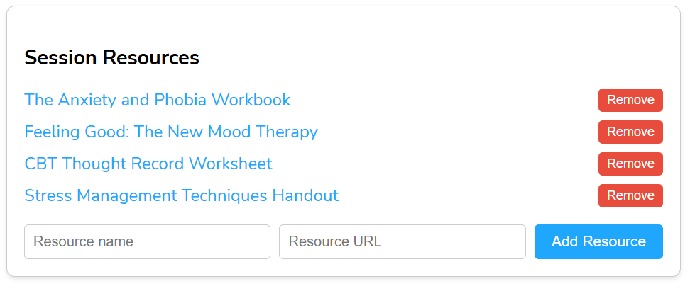

# MentalHealthDesignSystem

## Overview

MentalHealthDesignSystem is a comprehensive UI component library designed specifically for mental health applications. This project leverages the power of Angular and Storybook to create reusable, testable, and visually appealing components that enhance the user experience for both patients and healthcare providers.

## Demonstrating Team Leadership and Collaboration

The MentalHealthDesignSystem is a testament to effective team leadership and collaboration. By presenting a well-structured design system, we ensure that all team members, from developers to designers, work cohesively towards a common goal. Here’s how this design system fosters collaboration and leadership:

1. **Clear Documentation**: Comprehensive documentation, like this README, provides clear guidelines and instructions, ensuring that every team member understands the project's objectives and how to contribute effectively.

2. **Reusable Components**: By creating reusable components, we promote consistency across the application. This not only speeds up the development process but also ensures that the user experience is uniform and predictable.

3. **Storybook Integration**: Using Storybook allows team members to develop and test UI components in isolation. This encourages a modular approach to development and makes it easier for new team members to understand and contribute to the project.

4. **Version Control**: Leveraging tools like Git for version control ensures that all changes are tracked, and team members can collaborate without overwriting each other's work. This is crucial for maintaining the integrity of the codebase.

7. **Design Consistency**: The design system ensures that all components adhere to a consistent design language. This not only enhances the user experience but also makes it easier for designers and developers to collaborate.

8. **Scalability**: A well-architected design system allows the project to scale efficiently. As new features are added, the existing components can be reused and extended, reducing the need for redundant work.

By implementing these practices, the MentalHealthDesignSystem exemplifies how effective team leadership and collaboration can lead to the successful delivery of a high-quality product.

## Key Features

- **Angular CLI**: Built with Angular CLI version 18.2.3, ensuring a robust and scalable architecture.
- **Storybook Integration**: Develop and test UI components in isolation with Storybook, making it easier to create and document components.
- **Responsive Design**: Components are designed to be fully responsive, providing a seamless experience across different devices and screen sizes.
- **Customizable**: Easily customizable components to match the specific needs and branding of your mental health application.

## Patient Clinical UI Components

### Patient Allergy List
The Patient Allergy List component provides a detailed list of the patient's allergies, ensuring that healthcare providers are aware of any potential risks.

  

### Patient History Timeline
The Patient History Timeline component displays a chronological timeline of the patient's medical history, allowing for easy reference and review.

  

### Patient List
The Patient List component shows a list of patients, providing quick access to their profiles and key information.

  

### Patient Notes
The Patient Notes component allows healthcare providers to add and view notes related to the patient's care and treatment.

  

### Patient Profile Card
The Patient Profile Card component provides a snapshot of the patient's key information, including demographics and contact details.

  

### Putting it All Together - Patient Detail View
The Patient Detail View combines all the individual components into a comprehensive view of the patient's information.

  

## Session Clinical UI Components

### Session Goals
The Session Goals component outlines the specific goals set for the session, helping to keep the session focused and on track.

  

### Session Checklist
The Session Checklist component provides a list of tasks or items to be covered during the session, ensuring nothing is missed.

  

### Session Feedback Form
The Session Feedback Form component collects feedback from the patient or healthcare provider about the session, helping to improve future sessions.

  

### Session History
The Session History component records the details of previous sessions, allowing for continuity and reference in future sessions.

  

### Session Notes
The Session Notes component enables the recording of notes during the session, which can be reviewed and referenced later.

  

### Session Progress Tracker
The Session Progress Tracker component monitors the progress of the session's goals and objectives, providing real-time feedback.

  

### Session Recording
The Session Recording component allows for the recording of the session, which can be reviewed later for accuracy and completeness.

  

### Session Resources
The Session Resources component provides access to relevant resources and materials that can be used during the session.

  

### Session Summary
The Session Summary component provides an overview of the session's key points, including objectives, outcomes, and follow-up actions.

  

### Session Timer
The Session Timer component helps to manage the time allocated for the session, ensuring it stays within the planned duration.

  

### Putting it All Together - Session Detail View
The Session Detail View combines all the individual components into a comprehensive view of the session's information.

  

## Appointment UI Components

### Appointment Calendar
The Appointment Calendar component provides a visual representation of scheduled appointments, making it easy to see availability and conflicts.

  

### Appointment Card
The Appointment Card component displays key information about an appointment in a compact, easy-to-read format.

  

### Appointment List
The Appointment List component displays a list of upcoming and past appointments, providing quick access to appointment details.

  

### Appointment Search
The Appointment Search component allows users to search for appointments based on various criteria doctor and status.

  

### Appointment Scheduler
The Appointment Scheduler component allows users to schedule, reschedule, and cancel appointments with ease.

  

## Storybook

Storybook is a tool for developing UI components in isolation for Angular projects. It allows you to create and showcase components independently, making it easier to develop, test, and document them. 

To start Storybook, run `npm run storybook`. This will launch the Storybook server and open a new tab in your browser at `http://localhost:6006/`, where you can view and interact with your components.
